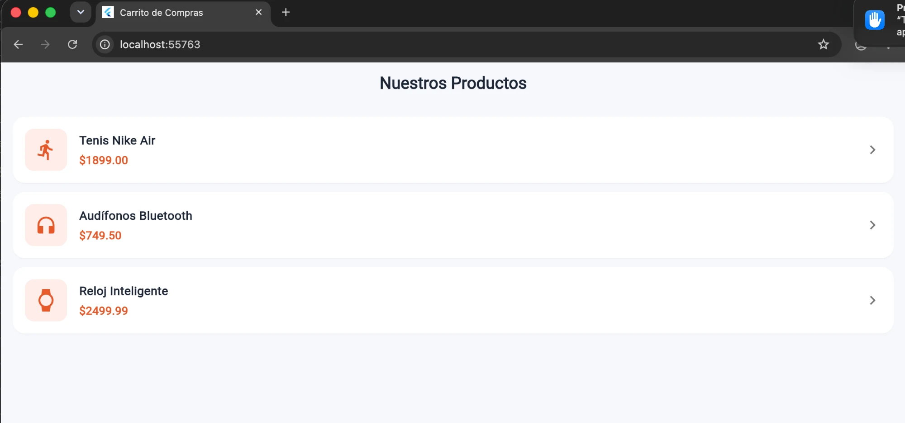
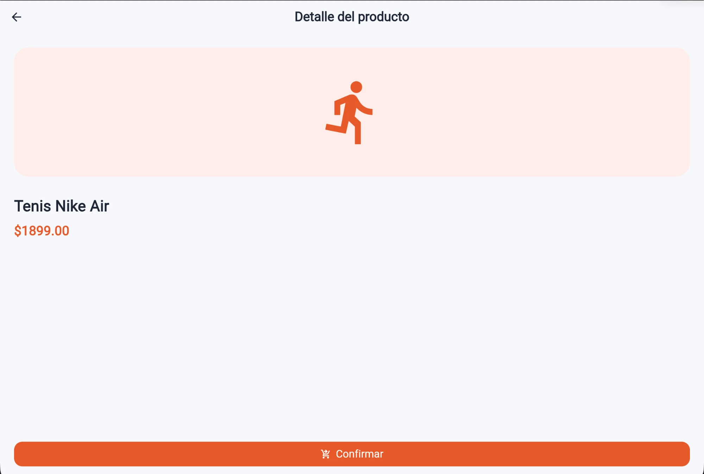
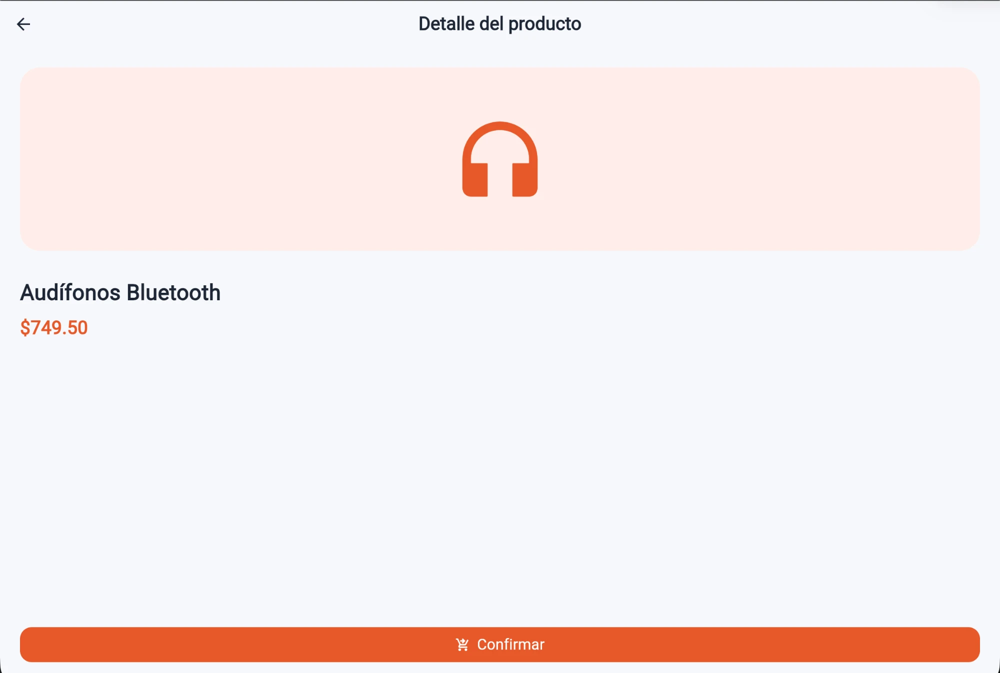
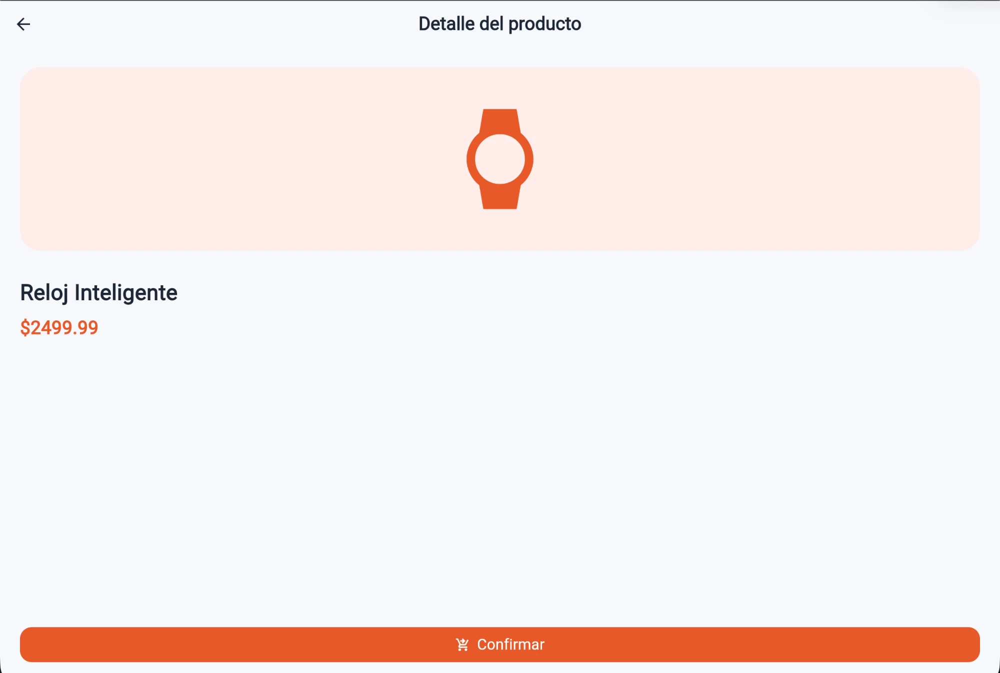

# M02 · Carrito de Compras

App Flutter de dos pantallas que simula un carrito de compras básico usando
**rutas nombradas** y **paso de información bidireccional**.

## Estructura

```
lib/
├── main.dart                         # MaterialApp + mapa `routes` (único archivo que importa las pantallas)
├── routes/app_routes.dart            # Identificadores String de las rutas
├── models/producto.dart              # Modelo Producto + lista estática de 3 productos
├── theme/app_colors.dart             # Paleta (inspirada en flutter_ecommerce_app)
└── screens/
    ├── lista_productos_screen.dart   # Pantalla 1: lista de productos
    └── detalle_producto_screen.dart  # Pantalla 2: detalle + botón Confirmar
```

## Cómo cumple la rúbrica

### Configuración y ejecución de rutas nombradas
- `MaterialApp` se configura con `initialRoute` y `routes` en `main.dart`.
- Se navega con `Navigator.pushNamed(context, AppRoutes.detalleProducto, ...)`,
  usando identificadores tipo `String` (`'/'` y `'/detalle-producto'`).
- `lista_productos_screen.dart` **no importa** `detalle_producto_screen.dart`;
  solo conoce el nombre de la ruta.

### Paso de información bidireccional
- **Ida:** el producto (nombre y precio) se envía con `arguments: producto`.
- **Extracción con seguridad de tipos:** en el destino se lee
  `ModalRoute.of(context)?.settings.arguments` y se valida con `is Producto`
  antes de usarlo (si no llega un producto, se muestra un mensaje en lugar de fallar).
- **Regreso:** el botón **Confirmar** ejecuta `Navigator.pop(context, true)`.
- **Espera del resultado:** la primera pantalla hace
  `await Navigator.pushNamed(...)` dentro de un método `async`; si el resultado
  es `true`, imprime en consola **`Compra confirmada`** (y muestra un SnackBar).

## Capturas y funcionamiento

### Pantalla 1 · Lista de productos



Es la ruta inicial (`'/'`), definida en `main.dart`:

```dart
initialRoute: AppRoutes.listaProductos,
routes: {
  AppRoutes.listaProductos: (context) => const ListaProductosScreen(),
  AppRoutes.detalleProducto: (context) => const DetalleProductoScreen(),
},
```

- Los 3 productos vienen de la lista estática `productosDisponibles` en
  `lib/models/producto.dart`. Cada tarjeta muestra el **nombre**, el **precio**
  (`precioFormateado`) y un ícono.
- `ListView.separated` recorre esa lista y crea un `_TarjetaProducto` por
  cada elemento.
- Al tocar una tarjeta (`InkWell.onTap`) se llama a `_abrirDetalle`, que navega
  con la **ruta nombrada** y envía el producto como argumento:

```dart
final Object? resultado = await Navigator.pushNamed(
  context,
  AppRoutes.detalleProducto,   // '/detalle-producto' (String)
  arguments: producto,         // nombre y precio viajan en el objeto Producto
);
```

Esta pantalla no importa `detalle_producto_screen.dart`. Solo conoce el nombre
de la ruta, así que `main.dart` es el único archivo que conoce las pantallas.

### Pantalla 2 · Detalle del producto

| Tenis Nike Air | Audífonos Bluetooth | Reloj Inteligente |
|:---:|:---:|:---:|
|  |  |  |

Es la misma pantalla (`DetalleProductoScreen`) en los tres casos. Lo que cambia
es el **argumento** recibido, y eso demuestra que la información sí se pasa
desde la pantalla 1.

1. **Extracción con `ModalRoute` y seguridad de tipos:**

   ```dart
   final Object? argumentos = ModalRoute.of(context)?.settings.arguments;
   if (argumentos is! Producto) { /* muestra "No se recibió ningún producto." */ }
   final Producto producto = argumentos;
   ```

   Se valida el tipo con `is` en vez de hacer un cast directo. Después de la
   comprobación, Dart trata `argumentos` como `Producto`, así que
   `producto.nombre`, `producto.precioFormateado` y `producto.icono` se usan
   con seguridad.

2. **Botón "Confirmar":** regresa a la pantalla anterior devolviendo `true`:

   ```dart
   onPressed: () => Navigator.pop(context, true),
   ```

   La flecha ← del `AppBar` también regresa, pero sin valor (`null`), así que
   en ese caso **no** se confirma la compra.

### Regreso · Compra confirmada

Al pulsar **Confirmar**, el `await` de la pantalla 1 termina y recibe el `true`:

```dart
if (resultado is bool && resultado) {
  debugPrint('Compra confirmada');   // se imprime en la consola
  ScaffoldMessenger.of(context).showSnackBar(...);  // aviso visual extra
}
```

En la terminal donde se ejecutó `flutter run` (o en la *Debug Console* de VS
Code) aparece:

```
Compra confirmada
```

## Ejecutar

```bash
flutter pub get
flutter run -d chrome
flutter test   # prueba el flujo completo: lista → detalle → Confirmar → "Compra confirmada"
```
